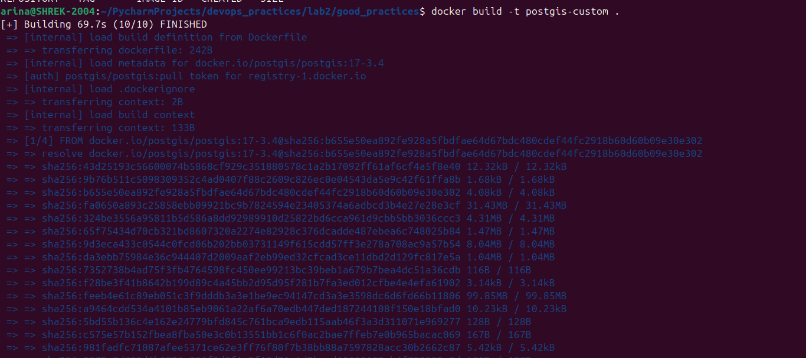
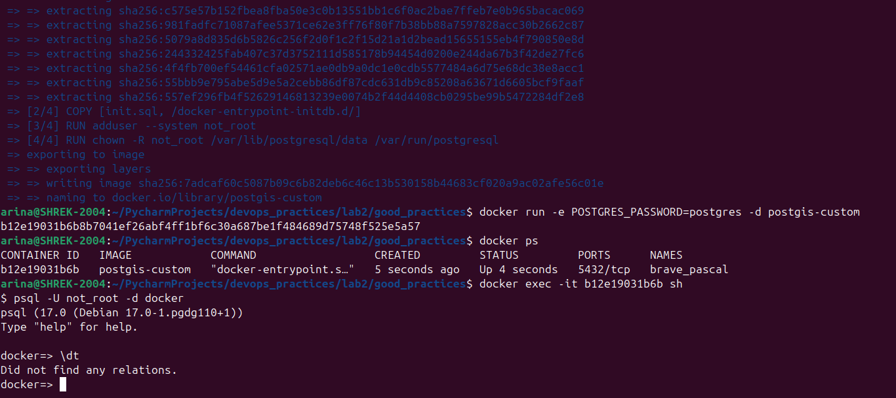

# Задание для Лабораторной 2 
## Обычная:
- Написать “плохой” Dockerfile, в котором есть не менее трех “bad practices” по написанию докерфайлов.
- Написать “хороший” Dockerfile, в котором эти плохие практики исправлены.
- В Readme описать каждую из плохих практик в плохом докерфайле, почему она плохая и как в хорошем она была исправлена, как исправление повлияло на результат.
- В Readme описать 2 плохих практики по работе с контейнерами. ! Не по написанию докерфайлов, а о том, как даже используя хороший докерфайл можно накосячить именно в работе с контейнерами.

## Со звездочкой:
- Написать “плохой” Docker compose файл, в котором есть не менее трех “bad practices” по их написанию.
- Написать “хороший” Docker compose файл, в котором эти плохие практики исправлены.
- В Readme описать каждую из плохих практик в плохом файле, почему она плохая и как в хорошем она была исправлена, как исправление повлияло на результат.
- После предыдущих пунктов в хорошем файле настроить сервисы так, чтобы контейнеры в рамках этого compose-проекта так же поднимались вместе, но не "видели" друг друга по сети. В отчете описать, как этого добились и кратко объяснить принцип такой изоляции.


# Выполнение
## Обычная
Для того, чтобы написать Dockerfile, самое простое, что можно сделать -- это обратиться к документации, в которой описана структура файла и значение каждой инструкции, используемой в docker-файлах. Я буду писать Dockerfile для PostGIS(это расширение для PostgreSQL, позволяющее оптимизировать с геоданными), так как сталкивалась с данным расширением несколько раз во время работы. 

### 1. Сначала нужно написать плохой файл с использованием нежелательных практик, получилось вот так: 
    ```
    FROM postgis:latest

    ENV POSTGERS_USER=arina
    ENV POSTGRES_PASSWORD=password
    ENV POSTGRES_DATABASE=docker

    ADD ["init.sql", "/docker-entrypoint-initdb.d/"]

В данном docker-файле допущены следующие ошибки:
- не указана конкретная версия postgis -- отсюда могут возникнуть проблемы с зависимостями, например, при разработке будет собираться образ с 13 версией, но спустя какое-то время выйдет 14, и при очередной сборке образа и создании на его основе контейнера могут возникнуть проблемы.
- явно указываются переменные среды: юзер, пароль и база данных: так лучше не делать из-за соображений безопасности.
- использование инструкции ADD для копирования в образ локальных файлов и директорий: есть две очень похожие инструкции COPY и ADD, но отличие заключается в том, что COPY используется для копирования с Docker-хоста в образ локальных файлов и директорий, а ADD можно использовать еще и для загрузки в образ файлов из внешних источников. Однако есть файл/директория локальные, то лучше использовать COPY, потому что эта команда более новая.
- отсутствует указание пользователя, для которого выполняются контейнеризированные процессы: из интернета можно узнать, что по умолчанию Docker выполняет процессы в контейнере с root-правами. Это может привести к проблемам с безопасностью, а именно: если хакер или злоумышленник или просто школьник получит доступ к контейнеру, то он получит доступ ко всем root-привелегиям, и в результате атаковать Docker-хост.

### 2. А теперь dockerfile с исправленными порочными практиками из предыдущего пункта: 
    ```
    FROM postgis/postgis:17-3.4

    COPY ["init.sql", "/docker-entrypoint-initdb.d/"]

    RUN adduser --system not_root

    USER root

    RUN chown -R not_root /var/lib/postgresql/data /var/run/postgresql

    USER not_root

- указана конкретная версия postgis, теперь проблем с разными версиями не будет, везде всегда будет одна конкретная, указанная в Dockerfile.
- переменные среды явно не указаны, они лежат в .env, и тогда сборку можно делать вот так: docker run --env-file <имя файла переменных> <имя образа>.
- вместо ADD используется COPY, так как копируются локальные файлы инициализации бд.
- создается пользователь not_root и указывается с помощью инструкции USER, теперь при сборке контейнера(после указания пользователя) и во время работы контейнера все команды будут выполнятся пользователем без привелегий.
- можно заметить, что в инструкции RUN выполняются две команды - addgroup и adduser, при этом исполняются они в одном RUN, с использованием &&. Так лучше, потому что каждая инструкция RUN создает новый слой в образе, что сказывается на производительности.

Создание образа по написанному файлу:

Подключение к контейнеру собранному по образу: 


### 3. Как используя хороший докерфайл можно накосячить в работе с контейнерами.

- Неочевидно-очевидная плохая практика - использование одного Dockerfile для нескольких процессов. То есть можно правильно и оптимально использовать все инструкции и команды, но если в одном файле несколько процессов, то могут возникнуть следующие проблемы: при необходимости остановить один процесс, нужно будет остановить все; трудности с логгированием и т.д. 
- Докер позволяет устанавливать "квоты" ресурсов для каждого контейнера, ограничивая потребление его памяти и ресурсов процессора. Это помогает поддерживать эффективность среды, предотвращать потребление слишком большого количества системных ресурсов одним контейнером. Поэтому стоит ограничивать ресурсы запускаемых контейнеров.

Источники, использованные при выполнении:

- https://docs.docker.com/reference/dockerfile/
- https://docs.docker.com/build/building/best-practices/
- https://habr.com/ru/companies/wunderfund/articles/586778/
