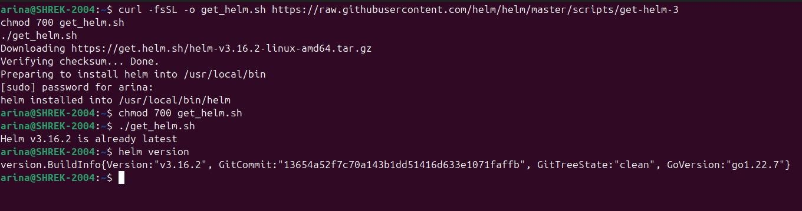
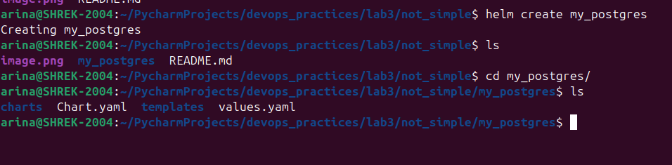
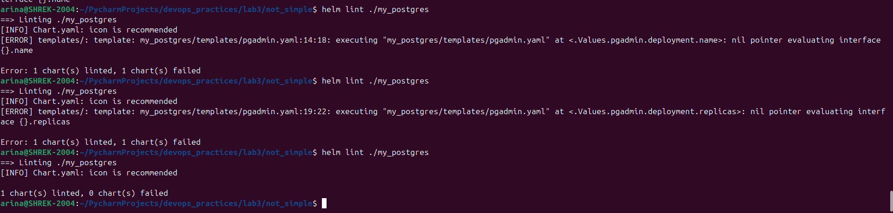
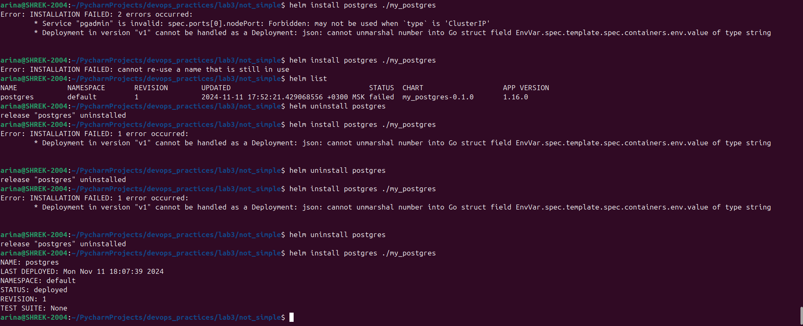
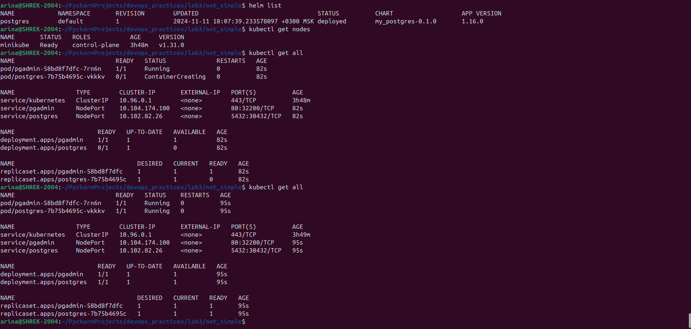
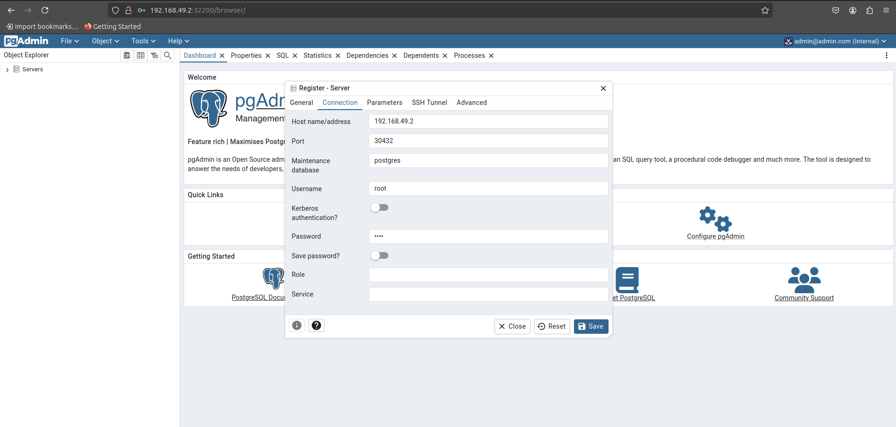
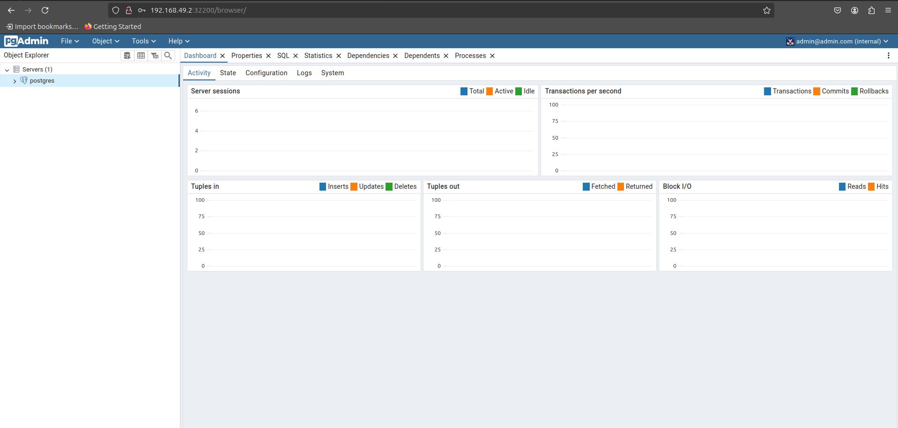
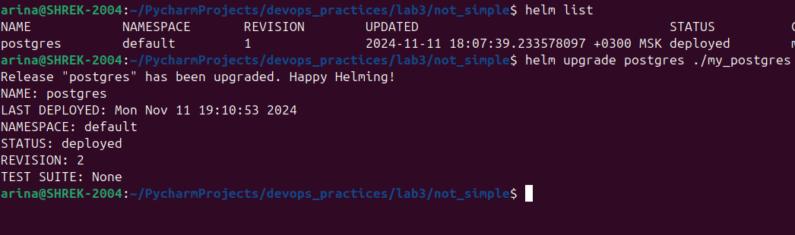
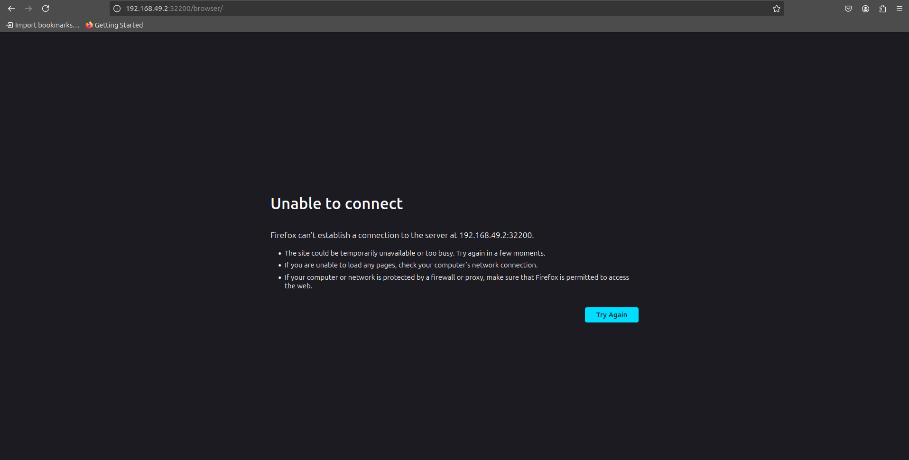
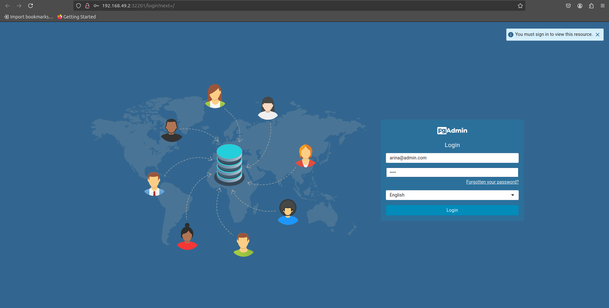

# Задание для Лабораторной 3
## Обычная:
- Поднять kubernetes кластер локально (например minikube) 
- В нём развернуть свой сервис, используя 2-3 ресурса kubernetes. В идеале разворачивать кодом из yaml файлов одной командой запуска. 
- Показать работоспособность сервиса.
*(сервис любой из своих не опенсорсных, вывод “hello world” в браузер тоже подойдёт)

## Со звездочкой:
- Создать helm chart на основе обычной 3 лабы
- Задеплоить его в кластер
- Поменять что-то в сервисе, задеплоить новую версию при помощи апгрейда релиза
- В отчете приложить скрины всего процесса, все использованные файлы, а также привести три причины, по которым использовать хелм удобнее чем классический деплой через кубернетес манифесты

# Выполнение
## Со звездочкой
### Установка Helm 
Для начала нужно установить helm, самый простой способ(как сказали умные люди их интернета) -- установить бинарный файл и добавить в системную переменную PATH. Это можно сделать с помощью следующей команды в терминале: 

    ```
    curl -fsSL -o get_helm.sh https://raw.githubusercontent.com/helm/helm/master/scripts/get-helm-3
    chmod 700 get_helm.sh
    ./get_helm.sh

Выполняем и проверяем установку и версию helm, видим, что все прошло успешно: 


### Создание чарта

Далее с помощью команды `helm create` создаем новый чарт и получаем базовый каркас в текущей директории:


У нас появились:
- Chart.yaml — это главный файл с метаданными и зависимостями;
- values.yaml —  здесь можно настраивать параметрами чарта;
- templates/ — тут лежат шаблоны манифестов Kubernetes, из которых генерируется итоговый релиз;
- charts/ — а тут лежат вложенные чарты, необходимые для работы основного приложения.

В Chart.yaml уже есть шаблонные значения, которые мы оставляем, так как они подходят под наши нужды:

    ```
    apiVersion: v2
    name: my_postgres
    description: A Helm chart for Kubernetes

    type: application

    version: 0.1.0

    appVersion: "1.16.0"

В values.yaml на основе обычной третьей лабораторной были заполнены следующие значения:

```
    postgres:
  appName: postgres

  secret:
    name: postgres-secret
    username: root
    password: "1111"
    usernameKey: postgres-root-username
    passwordKey: postgres-root-password

  persistentVolume:
    name: postgres-pv
    size: 1Gi
    accessMode: ReadWriteOnce
    path: /mnt/data

  persistentVolumeClaim:
    name: postgres-pvc
    size: 1Gi
    accessMode: ReadWriteOnce

  deployment:
    name: postgres
    replicas: 1
    image: postgres:latest
    containerName: postgres
    mountPath: /var/lib/postgresql/data

  resources:
    requests:
      cpu: "100m"
      memory: "256Mi"
    limits:
      cpu: "200m"
      memory: "512Mi"

  service:
    name: postgres
    portName: postgres
    port: 5432
    nodePort: 30432
    type: NodePort

pgadmin:
  appName: pgadmin

  secret:
    name: pgadmin-secret
    password: "1111"
    passwordKey: pgadmin-default-password
    
  
  delpoyment:
    name: pgadmin
    replicas: 1
    containerName: pgadmin4
    image: dpage/pgadmin4
    envPort: 80
    envEmail: "arine@admin.com"
    port:
      name: pgadminport
      number: 80
    
  service:
    name: pgadmin
    type: NodePort
    ports: 
      port: 80
      nodePort: 32201
```
В этом файле мы прописали все значения, которые хотим подставить в наши шаблоны, хранящиеся в директории templates, и которые мы можем обновлять когда заходим и пересобирать наш кубер с helm.

В отчете файлы-шаблоны не приведены, так как они достаточно объемны, но они находятся в папке отчета, где с ними можно ознакомиться.

- postgres.yaml : [ссылка](not_simple/my_postgres/templates/postgres.yaml)
- pgadmin.yaml : [ссылка](not_simple/my_postgres/templates/pgadmin.yaml)

Перед тем, как собирать релиз, проверим корректность с помощью линтера `helm lint`:



После нескольких небольших исправлений пытаемся задплоить командой `heln install` и получаем снова ошибку:


После исправления недочета в pgadmin.yaml получаем успех:


Теперь можем подключится к pgadmin через браузер:


И через pgadmin можем подключиться к базе данных:


Теперь внесем изменения в конфигурацию pgadmin, а именно изменим порт и значение почты администратора по умолчанию:

    ```
      delpoyment:
        name: pgadmin
        replicas: 1
        containerName: pgadmin4
        image: dpage/pgadmin4
        envPort: 80
        envEmail: "arine@admin.com"
        port:
            name: pgadminport
            number: 80
        
    service:
        name: pgadmin
        type: NodePort
        ports: 
            port: 80
            nodePort: 32201

Теперь обновляем с помощью команды `helm upgrade`:


И видим, что на старом порту pgadmin больше недоступен:


Но на новом мы снова можем к нему подключиться и все работает как нужно:



### Список источников:
- https://habr.com/ru/companies/flant/articles/423239/
- https://helm.sh/ru/docs/intro/quickstart/
- https://www.baeldung.com/ops/kubernetes-helm


