# Задание для Лабораторной 3
## Обычная:
- Поднять kubernetes кластер локально (например minikube) 
- В нём развернуть свой сервис, используя 2-3 ресурса kubernetes. В идеале разворачивать кодом из yaml файлов одной командой запуска. 
- Показать работоспособность сервиса.
*(сервис любой из своих не опенсорсных, вывод “hello world” в браузер тоже подойдёт)

## Со звездочкой:
- Создать helm chart на основе обычной 3 лабы
- Задеплоить его в кластер
- Поменять что-то в сервисе, задеплоить новую версию при помощи апгрейда релиза
- В отчете приложить скрины всего процесса, все использованные файлы, а также привести три причины, по которым использовать хелм удобнее чем классический деплой через кубернетес манифесты

# Выполнение
## Обычная
На моей машине не установлено ни полноценного kubernetes, ни minikube. Поэтому, следуя советам из интернета, сначала надо его установить. Устанавливать буду minikube, так как он прост в использовании и хорошо подходит для первого знакомства с kubernetes.

На всякий случай проверяем, что процессор поддерживает аппаратную виртуализацию с помощью следующей команды:

    ```grep -E --color 'vmx|svm' /proc/cpuinfo
Вывод не пустой, значит все хорошо и можно двигаться дальше: 

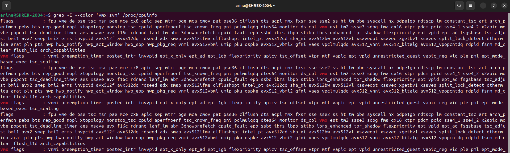

А дальше необходимо установить утилиту, которая позволит управлять кластером kubernetes, из вариантов kubectl, Lens, Kubernetes Dashboard я выбрала первый, потому что он самый легковесный :). Для этого следуем официальной документации и на выходе получаем:

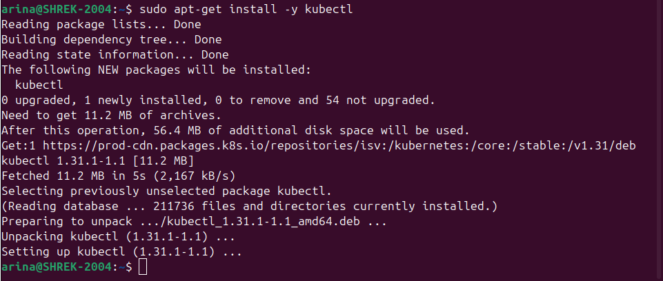

После этого удивляемся, что minikube нет в репозиториях моего дистрибутива линукс и устанавливаем его из бинарного файла:

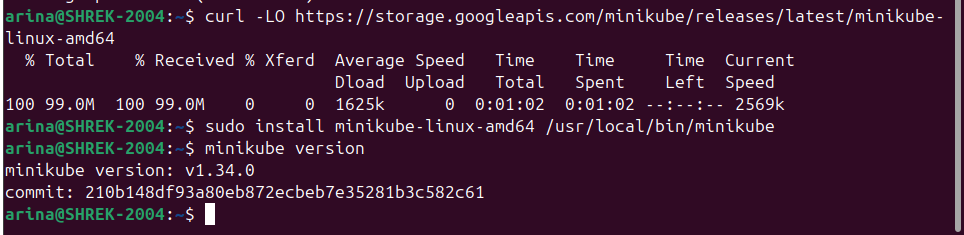

Запускаем minikube первый раз, ждем пока он скачает образ Kubernetes, создаст и настроит кластер,  помощью команды `kubectl get nodes` получаем успех: 

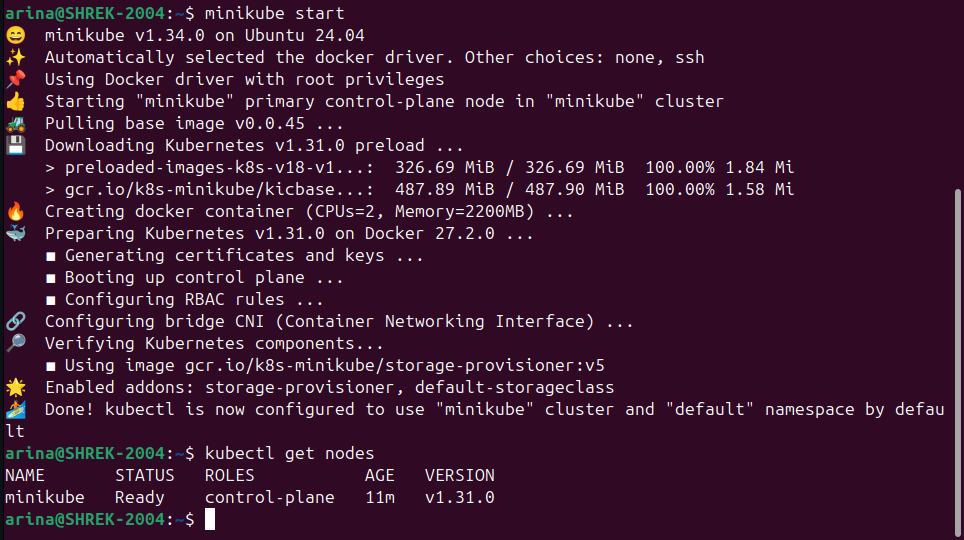

Теперь нужно написать конфигурацию для сервисов, написанного в предыдущей лабораторной. 

Сначала создадим два файла с секретами(логин и пароль) для pgadmin и postgres соответственно. В официальной документации kubernetes говорится: `A Secret is an object that contains a small amount of sensitive data such as a password, a token, or a key. Such information might otherwise be put in a Pod specification or in a container image. Using a Secret means that you don't need to include confidential data in your application code.` То есть секреты позволяют нам хранить чувствительные данные, такие как пароли, токены или ключи и скрыть их от посторонних глаз, имеющим доступ к коду и т.д.

Секрет для базы данных:

    ```
    apiVersion: v1
    kind: Secret
    metadata:
        name: postgres-secret
        labels:
            app: postgres
    type: Opaque
    data:
        postgres-root-username: cm9vdA==
        postgres-root-password: MTExMQ==

Секрет для pgadmin:

    ```
    apiVersion: v1
    kind: Secret
    metadata:
        name: pgadmin-secret
    type: Opaque
    data:
        pgadmin-default-password: MTExMQ==

Далее применяем написанные файлы с помощью команды `kubectl apply -f <имя_файла>`:

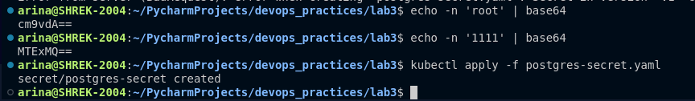

**Важно**: значения полей в data нужно обязательно шифровать, иначе вылетит ошибка: `Secret in version "v1" cannot be handled as a Secret: illegal base64 data at input byte 4`

Аналогично применяем pgadmin-secret:

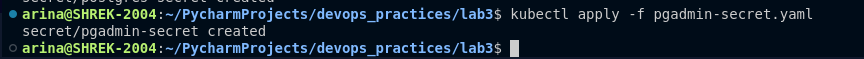

Опять выдержка из документации: `A Deployment manages a set of Pods to run an application workload, usually one that doesn't maintain state.` То есть для создания и конфигурации подов нам нужно написать Deployment-конфигарацию, в которой мы укажем количество подом и шаблон для из создания, для postgres получается так: 

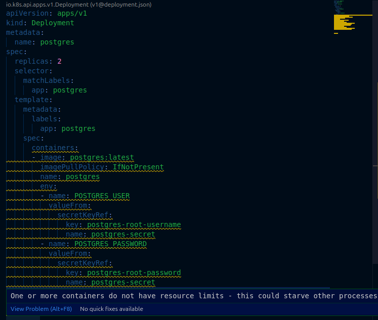

Для данной конфигурации Visual Studio Code подсказывает, что отсутствует конфигурация лимитов ресурсов, хотя и в таком виде применить конфигурацию получится, но для любопытства можно прописать лимиты, и тогда выйдет вот так:  

    ```
    apiVersion: apps/v1
    kind: Deployment
    metadata:
    name: postgres
    spec:
    replicas: 2
    selector:
        matchLabels:
        app: postgres
    template:
        metadata:
        labels:
            app: postgres
        spec:
        containers:
        - image: postgres:latest
            imagePullPolicy: IfNotPresent
            name: postgres
            env:
            - name: POSTGRES_USER
            valueFrom:
                secretKeyRef:
                key: postgres-root-username
                name: postgres-secret
            - name: POSTGRES_PASSWORD
            valueFrom:
                secretKeyRef:
                key: postgres-root-password
                name: postgres-secret
            resources:
            requests:
                cpu: "100m"
                memory: "256Mi"
            limits:
                cpu: "200m"
                memory: "512Mi"

    
Deployment-конфигурация для pgadmin: 

    ``` 
    apiVersion: v1
    kind: PersistentVolume
    metadata:
    name: postgres-pv
    spec:
    capacity:
        storage: 1Gi
    accessModes:
        - ReadWriteOnce
    hostPath:
        path: "/mnt/data"

    apiVersion: v1
    kind: PersistentVolumeClaim
    metadata:
    name: postgres-pvc
    spec:
    accessModes:
        - ReadWriteOnce
    resources:
        requests:
        storage: 1Gi

    apiVersion: apps/v1
    kind: Deployment
    metadata:
    name: pgadmin
    spec:
    selector:
    matchLabels:
        app: pgadmin
    replicas: 1
    template:
        metadata:
        labels:
            app: pgadmin
        spec:
        containers:
            - name: pgadmin4
            image: dpage/pgadmin4
            env:
            - name: PGADMIN_DEFAULT_EMAIL
                value: "admin@admin.com"
            - name: PGADMIN_DEFAULT_PASSWORD
                valueFrom:
                secretKeyRef:
                    name: pgadmin-secret
                    key: pgadmin-default-password
            - name: PGADMIN_PORT
                value: "80"
            ports:
                - containerPort: 80
                name: pgadminport
            resources:
                requests:
                cpu: "100m"
                memory: "256Mi"
                limits:
                cpu: "200m"
                memory: "512Mi"

Применение deployment-конфигураций для pgadmin и postgres: 

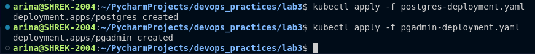

Последнее, что нужно сделать, это описать Service-конфигурацию, которая в документации определяется как `In Kubernetes, a Service is a method for exposing a network application that is running as one or more Pods in your cluster.`, то есть сервис позволяет создать одну точку обращения к нескольким подам, созданным в кластере.

Для postgres service-конфигурация выглядит следющим образом:

    ```
    apiVersion: v1
    kind: Service
    metadata:
    labels:
        app: postgres
    name: postgres
    spec:
    ports:
    - name: postgres
        nodePort: 30432
        port: 5432
    selector:
        app: postgres
    type: NodePort`    

А для pgadmin получилось вот так: 

    ```
    apiVersion: v1
    kind: Service
    metadata:
    name: pgadmin
    labels:
        app: pgadmin
    spec:
    selector:
        app: pgadmin
    type: NodePort
    ports:
    - port: 80
        nodePort: 30200

Теперь применяем их:

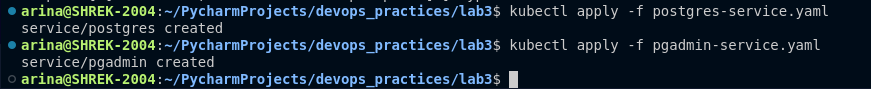

С помощью команды `kubectl ge all` можно получить информацию о все подах, сервисах и деплоиментах в кластере, после применения всех конфигураций вывод получается такой:

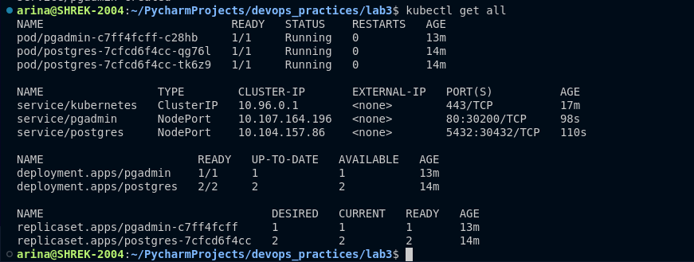

Подключимся к поду postgres и посмотрим, что мы можем делать внутри, для этого используем команду `exec` с указанием пода, подключаемся к терминалу и для этого указываем /bin/bash. Подключение успешно, входим в psql под кредами юзера, описанного в файлах конфигурации и видим, что БД пуста:

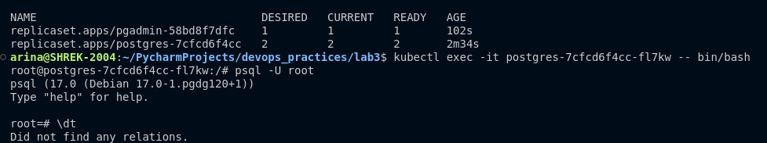

При этом мы можем работать с ней как с обычной базой данных postgres, как если бы она была запущена напрямую на нашей машине:

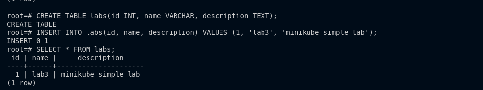

Теперь получим адрес pgadmin с помощью команды `minikube service pgadmin`:

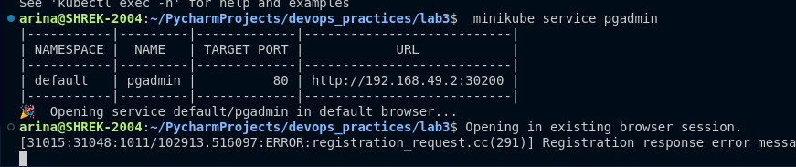

Видим страницу входа в pgadmin, входим под кредами из описанного ранее файла-секрета:

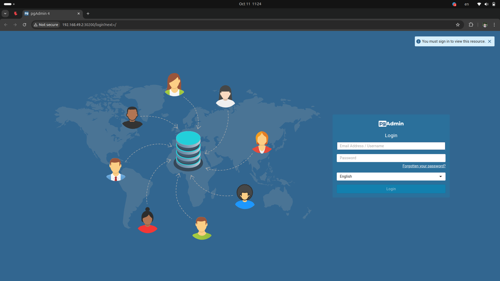

Теперь подключаемся к нашему postgres, указывая хост(можно также получить с помощью `minikube service postgres`) и порт(из файла-конфигурации сервиса postres):

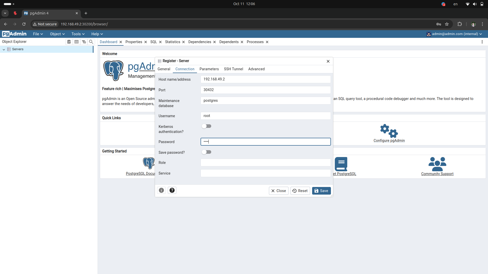

И успех, мы смогли подключиться:

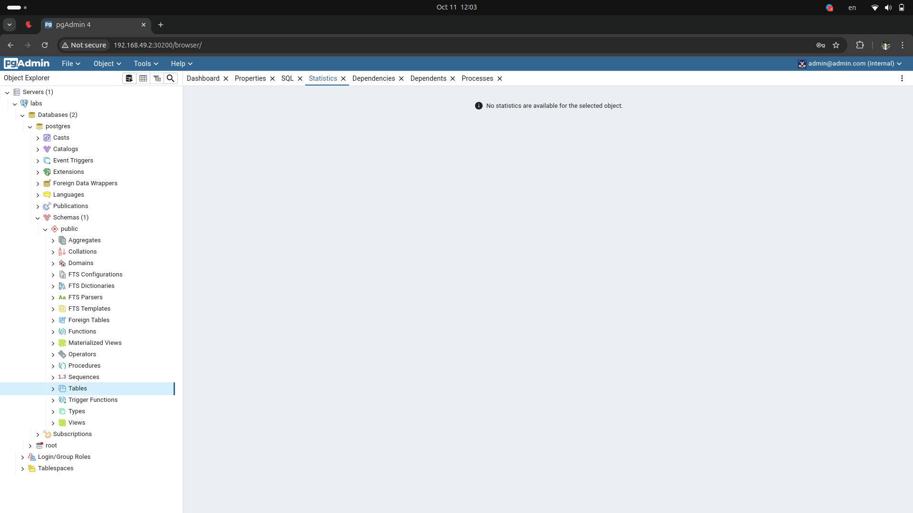

При этом можно слить всю конфигурацию для каждого из сервисов в один файл и запускать одной командой:
- для pgadmin слили в pgadmin.yaml
- для postgres слили в postgres.yaml

и тогда можно запускать вот так:
`kubectl apply -f <имя_сервиса>.yaml`

Использованные источники: 
- https://selectel.ru/blog/tutorials/how-to-run-kubernetes-with-minikube/
- https://kubernetes.io/docs/tasks/tools/install-kubectl-linux/#install-using-native-package-management
- https://www.youtube.com/watch?v=qmDzcu5uY1I

