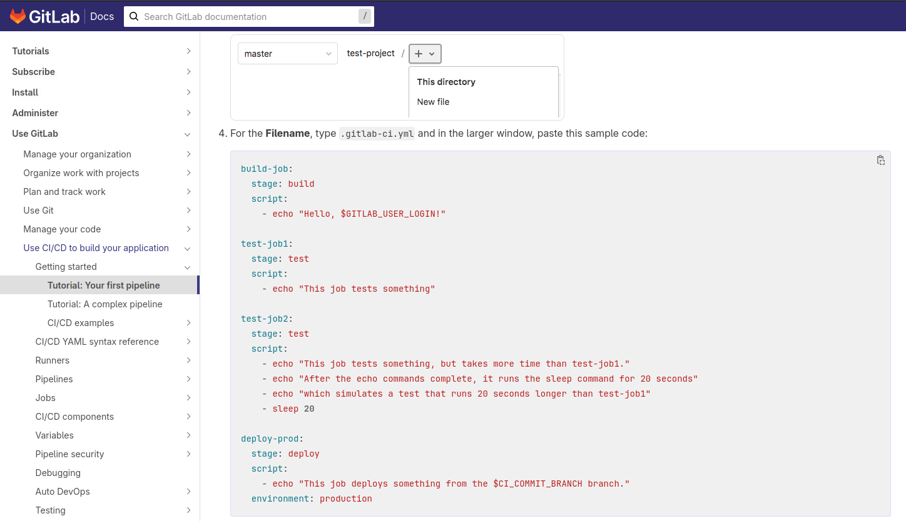
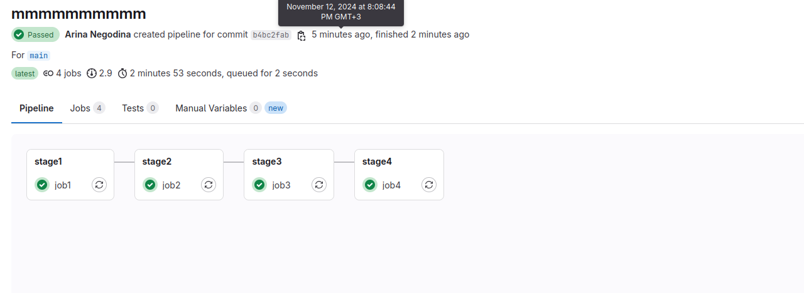
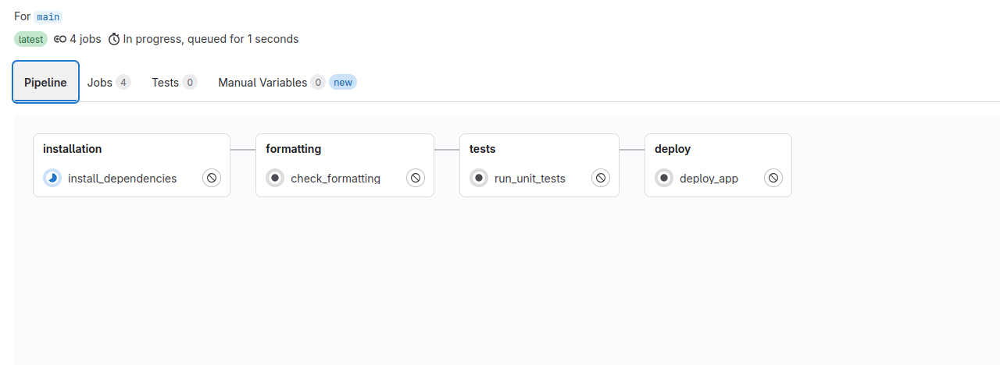
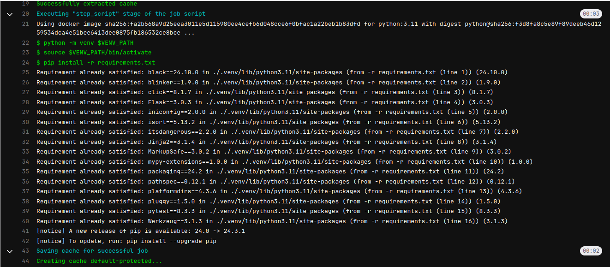
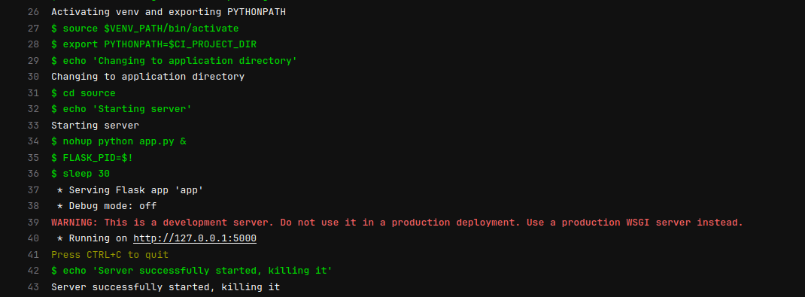

# Задание для Лабораторной 4
- Написать “плохой” CI/CD файл, который работает, но в нем есть не менее пяти “bad practices” по написанию CI/CD.
- Написать “хороший” CI/CD, в котором эти плохие практики исправлены.
- В Readme описать каждую из плохих практик в плохом файле, почему она плохая и как в хорошем она была исправлена, как исправление повлияло на результат.


# Выполнение
## Инициализация проекта

Для начала был создан небольшой репозиторий в GitLab со следующей структурой:
```
    .
    ├── README.md
    ├── requirements.txt
    ├── source
    │   ├── app.py
    │   ├── __init__.py
    │   └── scripts.py
    └── tests
        └── test_scripts.py
```
Репозиторий представляет из себя небольшое flask-приложение, содержащееся в `app.py` и три функции, используещиеся в приложении в `scripts.py`.

Также для юнит-тестирования написанных функций были созданы тесты с помощью pytes, они находятся в `tests/`.

## Создание плохого .gitlab-ci.yml

Теперь представим, что нам нужно создать пайплайн с помощью GitLab CI/CD, в котором будет:
- проверка code formatting через форматтеры black и isort
- прогонять тесты из `\tests`
- деплоить созданное flask-приложение

На самом деле достаточно тяжело написать по-настоящему отвратительный yaml-конфигурацию для CI/CD, потому что в какой туториал не глянь, даже в самых простых примерах и шаблонах из официальных документация разных платформ в конфигурациях задается достаточно четкая структура, например в официальной документации GitLab приводится вот такой пример в QuickStart:



Но сделаем вид, что мы не умеем читать доки и статьи на медиуме и хабре, и получим что-то такое:

```
image: python:latest

stages:
  - stage1
  - stage2
  - stage3
  - stage4
  
job1:
  stage: stage1
  script:
    - python -m venv .venv
    - source .venv/bin/activate
    - pip install -r requirements.txt

  artifacts:
    paths:
      - .venv

job2:
  stage: stage2
  script:
    - source .venv/bin/activate
    - export PYTHONPATH=$CI_PROJECT_DIR
    - black . --check
    - isort . -c

  dependencies:
    - job1


job3:
  stage: stage3
  script:
    - source .venv/bin/activate
    - export PYTHONPATH=$CI_PROJECT_DIR
    - pytest tests/

  dependencies:
    - job1


job4:
  stage: stage4
  script:
    - source .venv/bin/activate
    - export PYTHONPATH=$CI_PROJECT_DIR
    - cd source
    - nohup python app.py &
    - FLASK_PID=$!
    - sleep 30
    - kill $FLASK_PID 

```
## И тут начинается разбор ошибок...
### 1) Неочевидные названия для этапов и джоб
В интерфейсе GitLab можно посмотреть, что из себя представляет данный пайплайн:



Стало ли понятнее, что происходит на каждом этапе и в каждой джобе? Нет...
А все дела в неймингах, ведь всему стоит давать название со смыслом, чтобы была понятна задача каждого этапа и каждой джобы, иначе только создатель данного yaml будет понимать, как что работает(и то не факт).

Поэтому стоит переименовать этапы и джобы:

- `stage1` -> `installation`
- `stage2` -> `formatting`
- `stage3` -> `tests`
- `stage4` -> `deploy`

- `job1` -> `install_dependencies`
- `job2` -> `check_formatting`
- `job3` -> `run_unit_tests`
- `job4` -> `deploy_app`

Теперь в интерфейсе GitLab все выглядит приличнее:



### 2) И снова :latest ...

Как и в Dockerfile, в конфишурации CI/CD иногда нужно использовать образы, и как много раз говорилось во второй лабораторной, не стоит брать последний образ, лучше указать конкретную версию во избежание проблем в будущем, поэтому:

- `image: python:latest` -> `image: python:3.11`

### 3) Отсутствие переменных

В файле конфигурации путь к директории виртуального окружения `.venv` используется 6 раз, хотя сама конфигурация небольшая, но при необходимости изменить ипользуемое значение можно пропустить одно из мест его использований и потом ломать голову, почему ничего не работает. А если представить, что таких значений будет несколько на один файл и все они будут использоваться по многу раз, то становится понятно, что лучше это куда-то вынести...

Поэтому создаем раздел с переменными, записываем значение и заменяем во всех местах использования на переменную:

```
variables:
  VENV_PATH: .venv
```

### 4) Отсутствие кеширования

Внимательно посмотрим на все исполняемые джобы в рамках данного проекта:


Джоба stage1, в последствии переименованная в install_dependencies, выполняется более 40 секунд, причем каждый раз заново, что достаточно много по времени. В этой джобе устанавливаются зависимости окружения, и чтобы не устанавливать их каждый раз, нужно как то их запомнить для переиспользования, для этого можно их закешировать, вот так:

```
cache:
  paths:
    - $VENV_PATH/
    - __pycache__/
```

И тогда на выходе получим, что теперь при установке зависимостей pip ходит в кеш и при наличии там нужной зависимости соответствующей версии, она берется оттуда, а время выполнения джобы сократилось в 1,5 раза:



### 5) Без комментариев

Вопрос в интернетах спорный, но некоторые пользователи считают (и я присоединяюсь к их мнению), что на сложных этапах стоит добавлять какие-либо комментарии к процессу, например:

```
deploy_app:
  stage: deploy
  script:
    - echo 'Activating venv and exporting PYTHONPATH'
    - source $VENV_PATH/bin/activate
    - export PYTHONPATH=$CI_PROJECT_DIR
    - echo 'Changing to application directory'
    - cd source
    - echo 'Starting server'
    - nohup python app.py &
    - FLASK_PID=$!
    - sleep 30
    - echo 'Server successfully started, killing it'
    - kill $FLASK_PID 
```
Теперь в случае, когда пайплайн не пройдет при очередных изменениях, на джобе с относительно большим количеством действий будет понятно, на каком моменте что-то пошло не так, ведь есть комментарии:


В итоге получили:
```
image: python:3.11

variables:
  VENV_PATH: .venv

cache:
  paths:
    - $VENV_PATH/
    - __pycache__/

stages:
  - installation
  - formatting
  - tests
  - deploy
  
install_dependencies:
  stage: installation
  script:
    - python -m venv $VENV_PATH
    - source $VENV_PATH/bin/activate
    - pip install -r requirements.txt

  artifacts:
    paths:
      - $VENV_PATH

check_formatting:
  stage: formatting
  script:
    - source $VENV_PATH/bin/activate
    - export PYTHONPATH=$CI_PROJECT_DIR
    - black . --check
    - isort . -c

  dependencies:
    - install_dependencies


run_unit_tests:
  stage: tests
  script:
    - source $VENV_PATH/bin/activate
    - export PYTHONPATH=$CI_PROJECT_DIR
    - pytest tests/

  dependencies:
    - install_dependencies

deploy_app:
  stage: deploy
  script:
    - echo 'Activating venv and exporting PYTHONPATH'
    - source $VENV_PATH/bin/activate
    - export PYTHONPATH=$CI_PROJECT_DIR
    - echo 'Changing to application directory'
    - cd source
    - echo 'Starting server'
    - nohup python app.py &
    - FLASK_PID=$!
    - sleep 30
    - echo 'Server successfully started, killing it'
    - kill $FLASK_PID 
```

Кажется, успех!