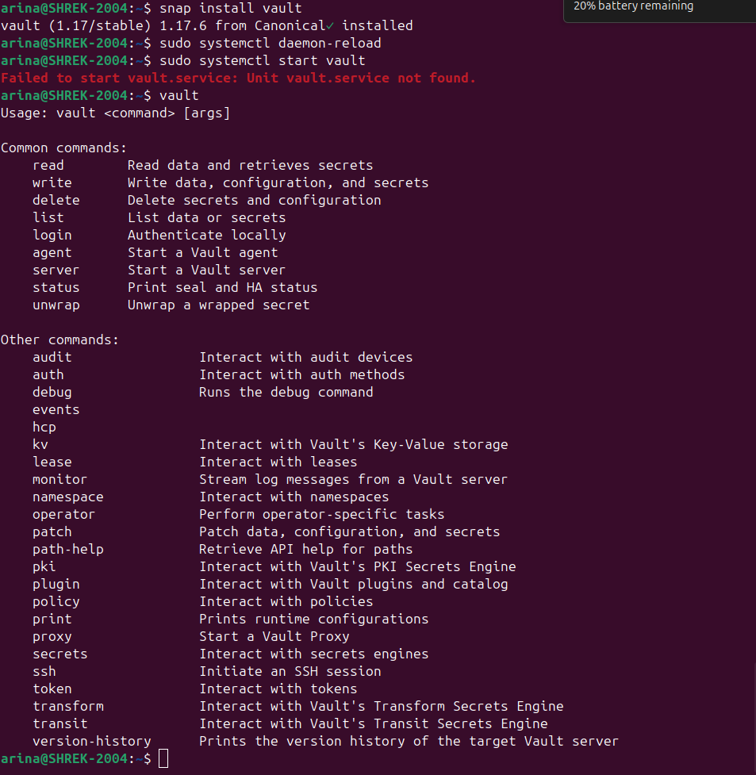
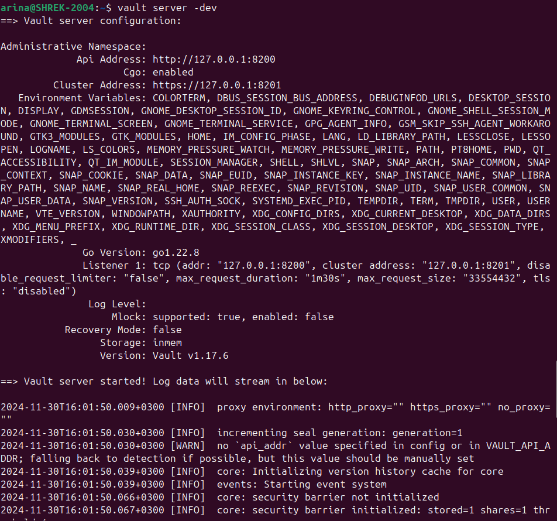
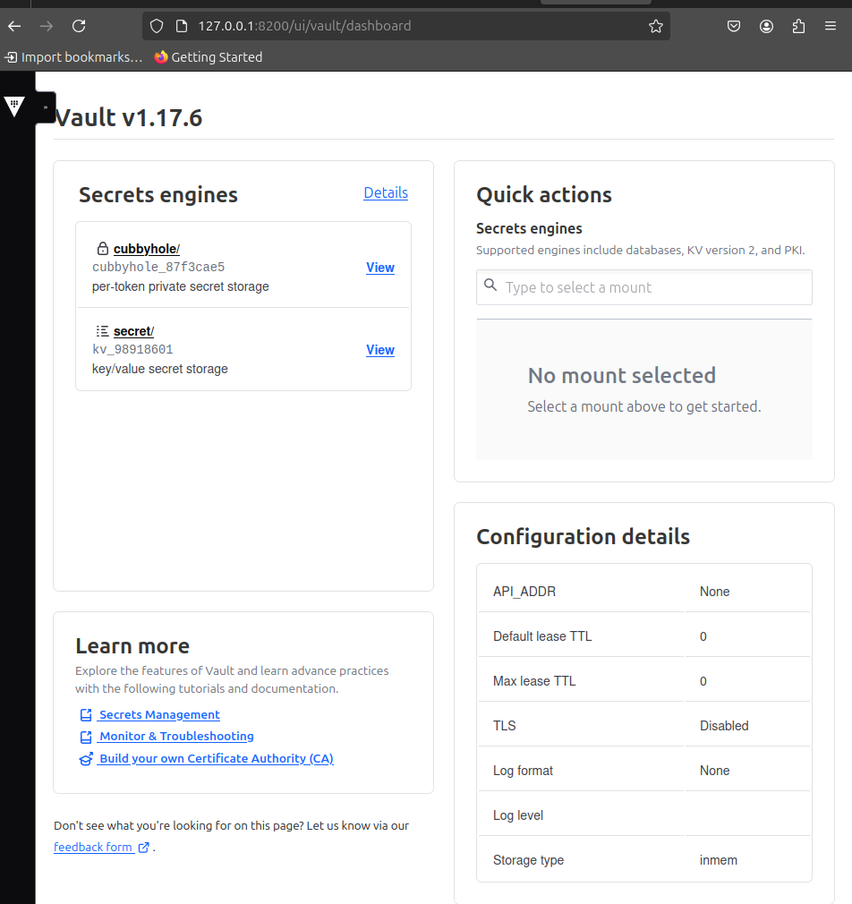
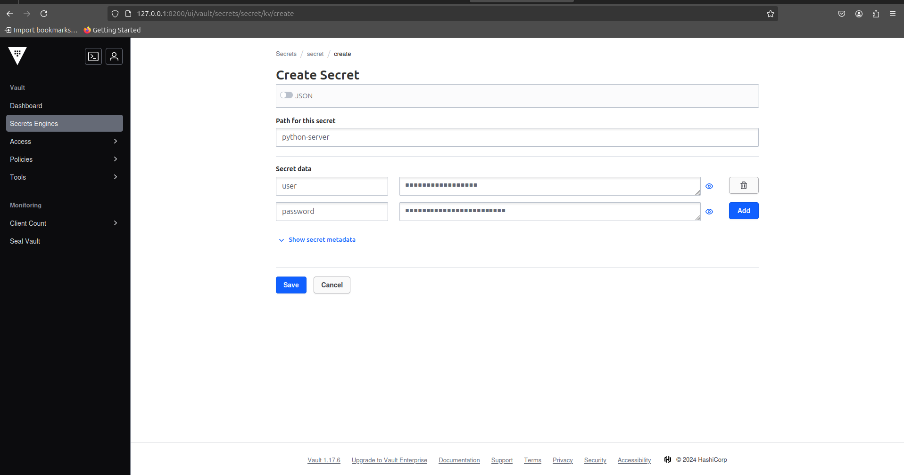
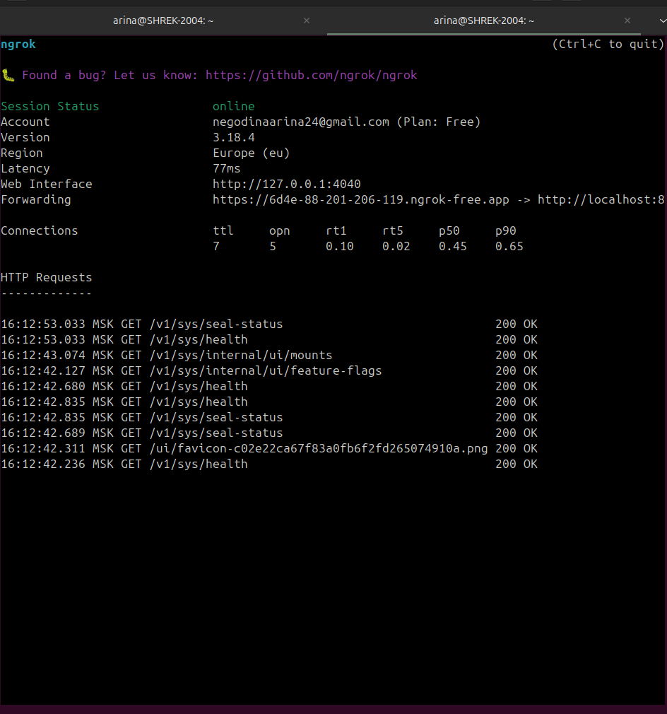
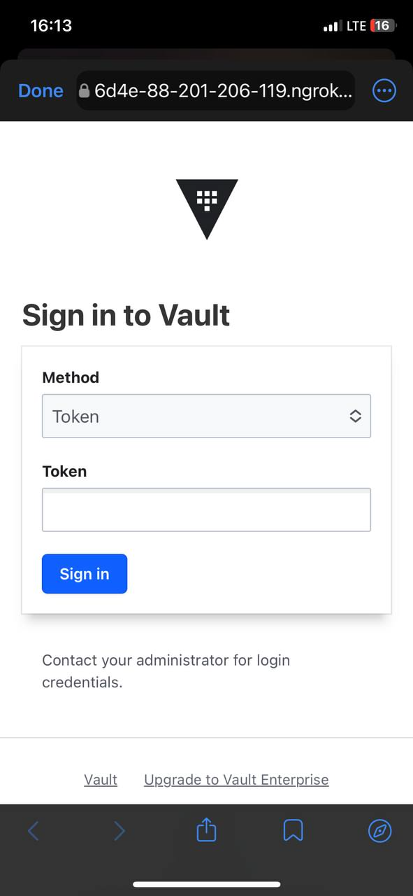
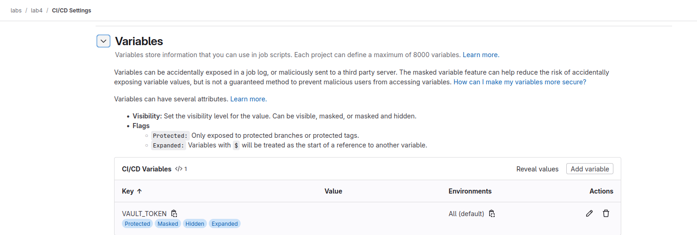
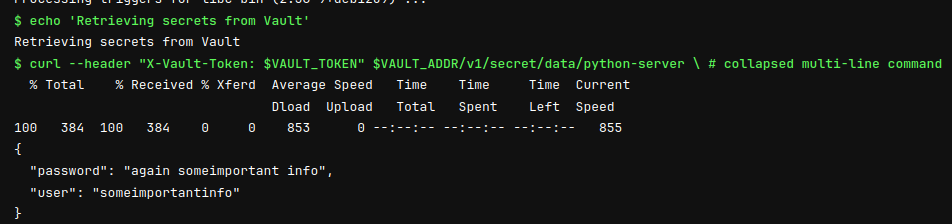
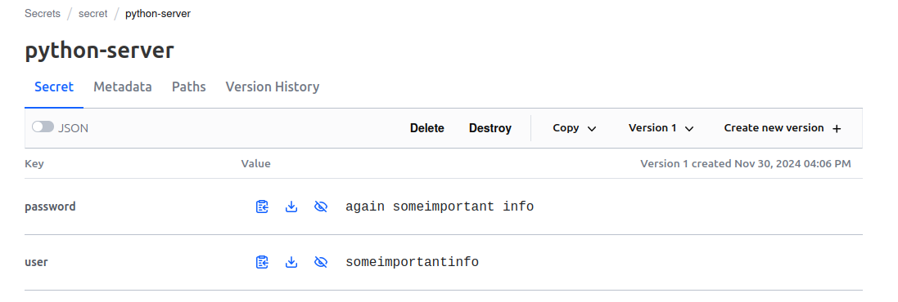

# Задание для Лабораторной 4*
Сделать красиво работу с секретами. Например, поднять Hashicorp Vault и сделать так, чтобы ci/cd пайплайн (или любой другой ваш сервис) ходил туда, брал секрет, использовал его не светя в логах. В Readme аргументировать почему ваш способ красивый, а также описать, почему хранение секретов в CI/CD переменных репозитория не является хорошей практикой.
# Выполнение
## Установка Vault
Сначала необходимо установить vault, чтобы локально развернуть сервер, устанавливаем с помощью менеджера snap (в репозиториях t-get vault отсутствует, поэтому стандартный apt-get не подойдет для установки). После установки проверяем с помощью `vault`, что все установилось:

Далее запускаем сервер с помощью `vault server -dev`:

Заходим через браузер по адресу, на котором развернут сервер и получаем доступ к интерфйсу Vault:

Создаем два секрета, которые далее нужно будет использовать в нашем пайплайне:

Так как у моего устройства серый ip, мы не можем в данный момент подключиться к vault извне, и для этого пробрасываем порт через ngrok:

Пробуем перейти по полученному белому адресу через телефон и видим, что доступ есть:

## Настройка GitLab
Теперь заведем защищенную переменную среды для пайплайна в GitLab, в которой будет лежать токен для доступа к серверу:

Теперь добавим в .yml команды дл подключения и извдечения секретов с Vault:
```
variables:
  VAULT_ADDR: "https://6d4e-88-201-206-119.ngrok-free.app"
  ...
  deploy_app:
  stage: deploy
  script:
    - echo 'Installing jq'
    - apt-get update && apt-get install -y jq
    - echo 'Retrieving secrets from Vault'
    - |
      curl --header "X-Vault-Token: $VAULT_TOKEN" $VAULT_ADDR/v1/secret/data/python-server \
      | jq -r '.data.data'
```
Запускаем пайплайн и видим, что выводятся два секрета:

И они совпадают с тем, что мы создавали в Vault:

Очевидно, что секреты были выведены в лог пайплайна исключительно в целях демонстрации, что удалось подтянуть их с Vault, а так после подтягивания их можно использовать для аутентификации или чего-либо еще в зависимости от потребностей. 

В данном решении:
- Секреты не хранятся в репозитории GitLab, что позволяет избежать случая получения секретов злоумышленниками, если они получает доступ к репозиторию
- В логах секреты не видны (в нашем случае видны, потому что мы специально их вывели), что также защищает секреты от злоумышленников. 