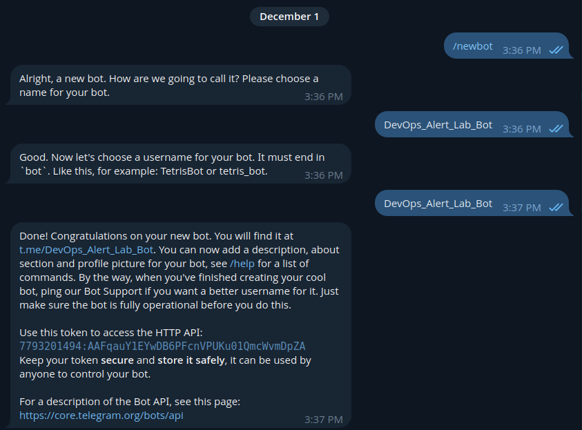
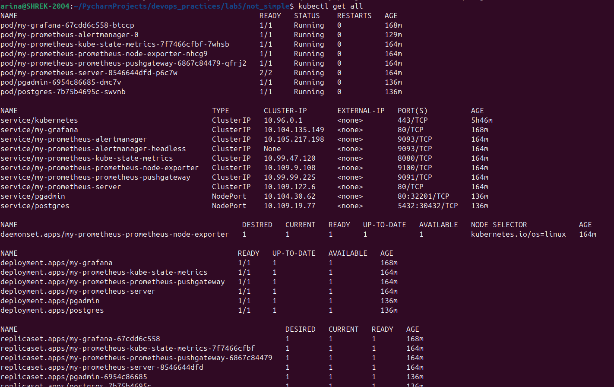
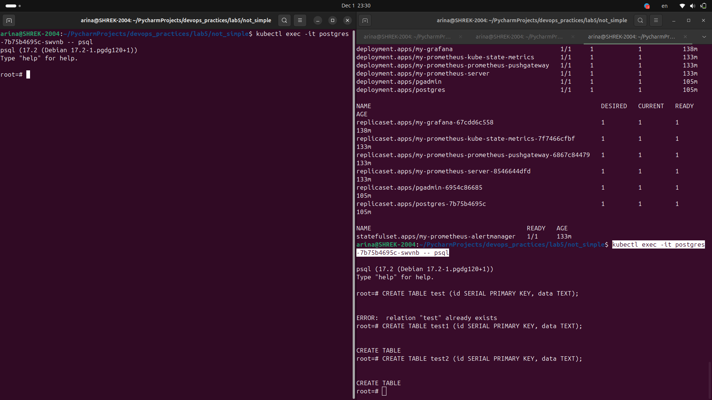
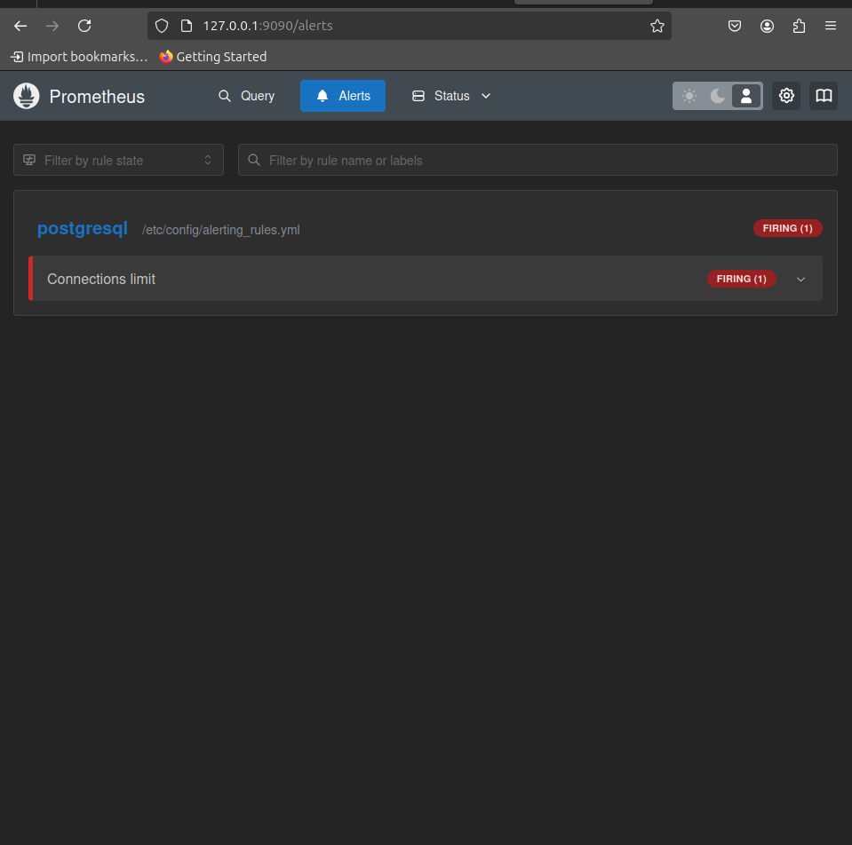
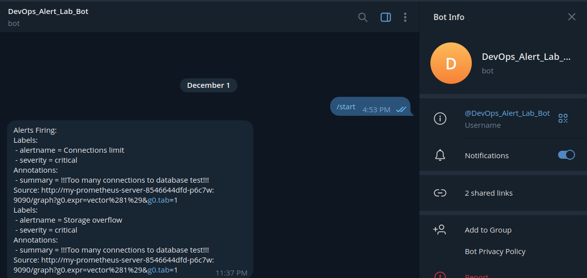

# Задание для Лабораторной 5*
Настроить алерт кодом IaaC (например через конфиг алертменеджера, главное - не в интерфейсе графаны:), показать пример его срабатывания. Попробовать сделать так, чтобы он приходил, например, на почту или в телеграм. Если не получится - показать имеющийся результат и аргументировать, почему дальше невозможно реализовать.

# Выполнение
Для начала необходимо создать телешрам-бот, которых будет присылать уведомления:

Далее по очереди поднимаем созданный нами ранее postgres через helm, а также prometheus, в общем как в предыдущей лабе с помощью команд:
`helm install my-postgres ./my_postgres`
`helm install my-prometheus prometheus-community/prometheus`
Проверяем что все живы:

Далее нужно написать файл .yaml для изменения настроек алерта в prometheus, в нем будет прописано куда слать уведомления, в каком виде их слать(у нас в самом простом) и сами правила, по которым будет проходить мониторинг и при их нарушении отправляться уведовление:
```
alertmanager:
  config:
    global:
      resolve_timeout: 5m
      telegram_api_url: "https://api.telegram.org"

    route:
      receiver: telegram-bot

    receivers:
      - name: telegram-bot
        telegram_configs:
          - chat_id: 745035865
            bot_token: 7793201494:AAFqauY1EYwDB6PFcnVPUKu01QmcWvmDpZA
            api_url: "https://api.telegram.org"
            send_resolved: true
            parse_mode: ''

serverFiles:
  alerting_rules.yml:
    groups:
      - name: postgresql
        rules:
        - alert: Connections limit
          expr: pg_stat_activity_count > 1
          for: 1m
          labels:
            severity: critical
          annotations:
            summary: "!!!Too many connections to database test!!!"
```

Самым главным по сути тут является выражение(expr), по которому как раз таки и происходит слежка. В нашем случае при количестве активных подключений к БД больше 1 будет высылаться алерт на телеграм(очевидно, что число 1 в качесвте границы количесвта подключений взято для удобства,чтоб при тестированиее не создавать тысячу подключений и тд)

Теперь умело делаем два подключения к бд:

Потом ждем.....
Потом лезем в интерфейс графаны, предварительно пробросив порт с помощью `export POD_NAME=$(kubectl get pods --namespace default -l "app.kubernetes.io/name=prometheus,app.kubernetes.io/instance=my-prometheus" -o jsonpath="{.items[0].metadata.name}")
  kubectl --namespace default port-forward $POD_NAME 9090` и обнаруживаем:


Подождав еще чуть чуть, обнаруживаем прилетевшее в телеграм сообщение:


Радуемся, благодарим маму и друзей что верили в мой успех, вытираем слезыс щек и спокойно ложимся спать зная, что к нашей бд пришло на фан встречу более 1 человека.