# Задание для Лабораторной 5
Сделать мониторинг сервиса, поднятого в кубере (использовать, например, prometheus и grafana). Показать хотя бы два рабочих графика, которые будут отражать состояние системы. Приложить скриншоты всего процесса настройки.

# Выполнение

## Настройка Grafana

Для начала лабораторной работы нужно установить grafana, для этого будем следовать официальной документации (https://grafana.com/docs/grafana/latest/setup-grafana/installation/helm/), по ней сначала добавить репозиторий grafana в helm на свою машину с помощью команды `helm repo add grafana`:

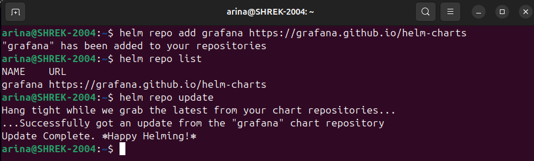

Потом запускаем миникуб и создаем пространство имен monitoring с помощью команды `kubectl create namespace monitoring`, в котором и будем работать:


Теперь, следуя документации, проверяем, насколько успешно установился репозиторий grafana с помощью команды `helm search repo` и, убедившись в успешности, с помощью `helm install` запускаем grafana: 
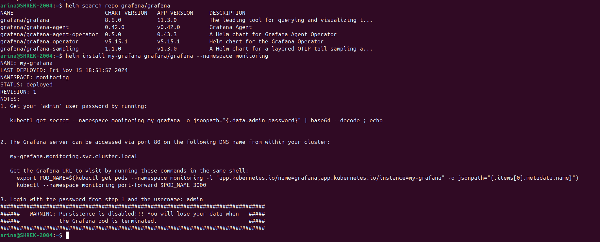

С помощью `helm list` проверяем, что в созданном пространстве имен успешность создания grafana, и делаем то же самое с `kubectl get all -n monitoring`, видим, что все хорошо:

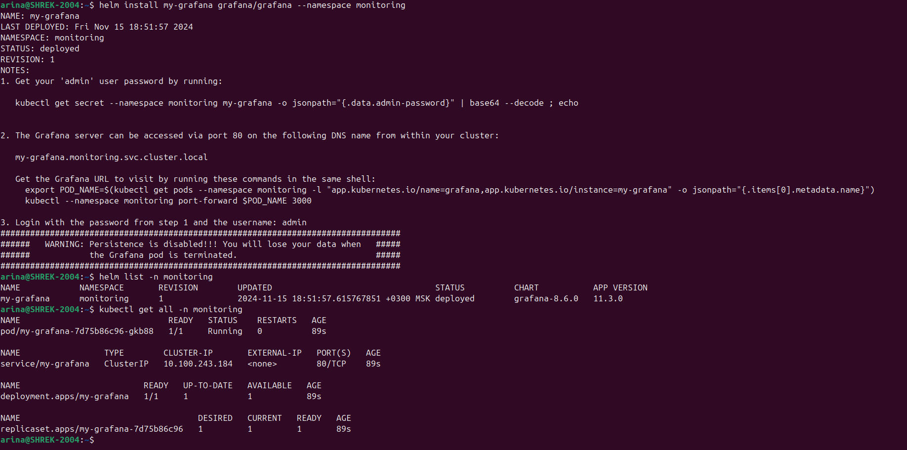

Дальше вспоминаем, что не посмотрели пароль от дефолтного пользователся admin с помощью команды, которая привелась при запусске grafana в NOTES:

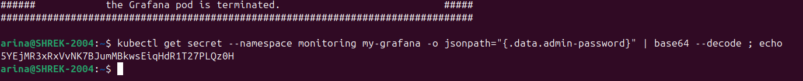

Далее после проброса портов с помощью команды `kubectl --namespace monitoring port-forward $POD_NAME 3000`, которую также подсказала grafana, можем получить доступ к интерфейсу grafana через браузер:  

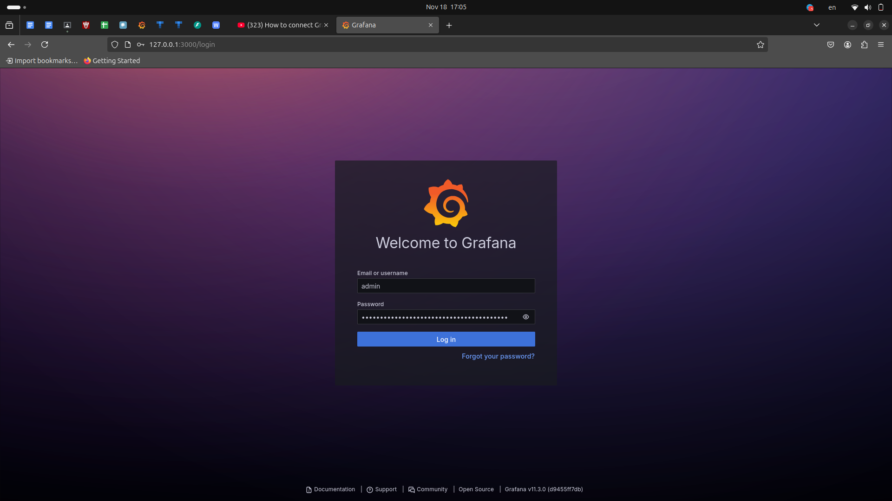

## Настройка Prometheus

Теперь аналогично копируем в helm репозиторий prometheus через `helm repo add` и устанавливаем с помощью `helm install`(В последней строке скриншота можно увидеть адрес, по которому prometheus доступен внутри кластера, но к сожалению, я не люблю читать и не читаю, что выводят мне в подсказках, что добавит головной боли и путаницы в работе):

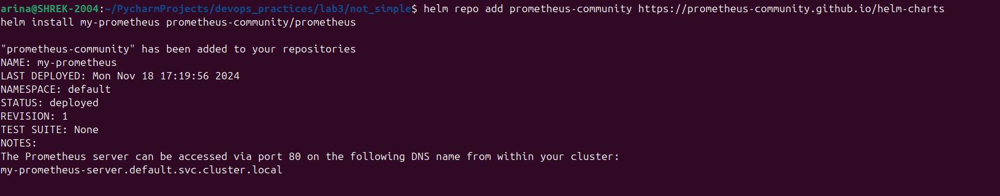

Проверяем, что все запустилось с помощью `kubectl get`:

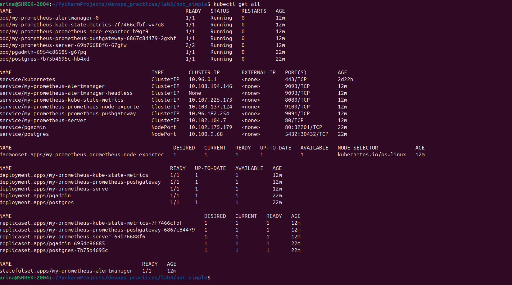

Теперь я решила получить адрес сервиса prometheus аналогично тому, как я получала адрес сервиса postgresql в Лабораторной 3, через `minikube service <название сервиса>`:

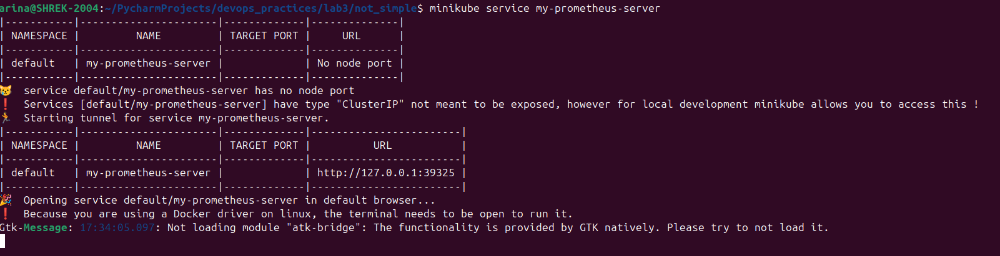

И вбила полученный адрес при настройке Data Source для последующего создания дашбордов для мониторинга:

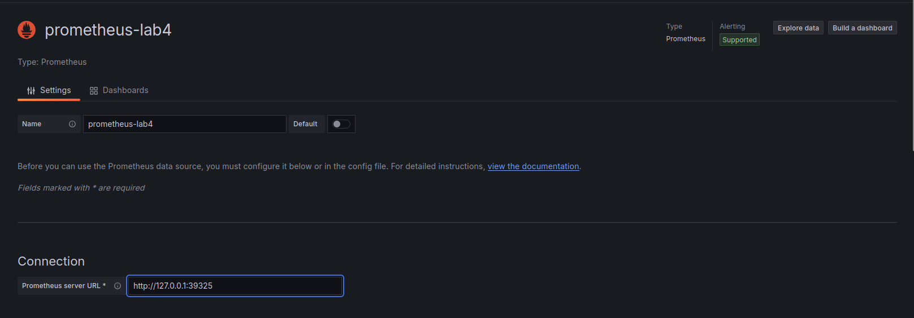

И получила ошибку:

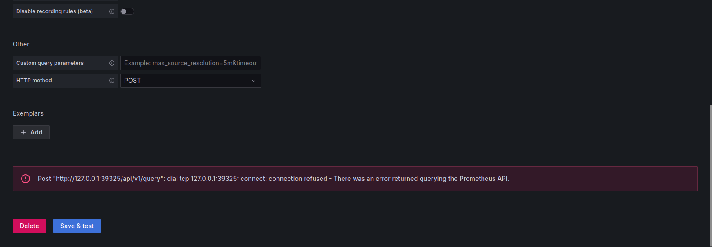

По совету интернетов пробросила порты для prometheus аналогично тому, как уже делалось в данной лабораторной для grafana:


В браузере доступ к prometheus есть, но подключить его к grafana все еще не выходило:

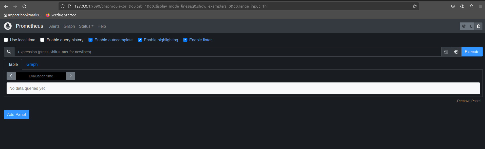

Продолжая изучение интернетов понимаем, что и postgres не настроен для мониторинга, так как в конфигурации, написанной в Лабораторной 3*, нет следующего:
```
metrics:
  enabled: true
```

Добавив это в values.yml, обновляем с помощью `helm upgrade`:

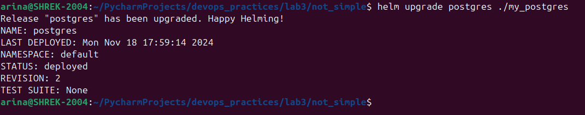

А далее, перечитав все предыдущие шаги, я попробовала подключить grafana к prometheus через адрес my-prometheus-server.default.svc.cluster.local, о котором писалав отчете выше: 

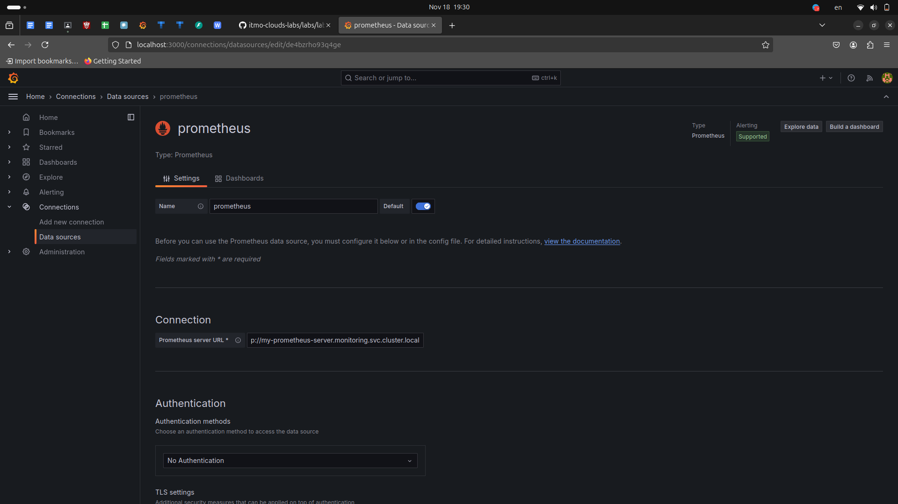

И таким образом все получилось, при этом проброс портов для prometheus здесь не нужен:

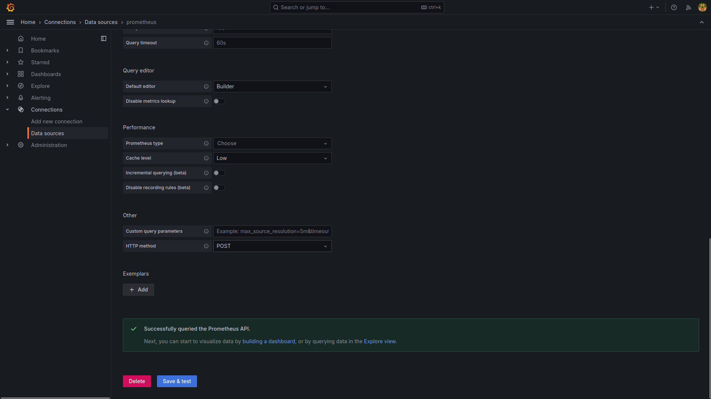

Далее по туториалам из интернетов делаем дашборты для мониторинга БД, а именно для сбора статистики текущих сессий, транзакций, операция CRUD:

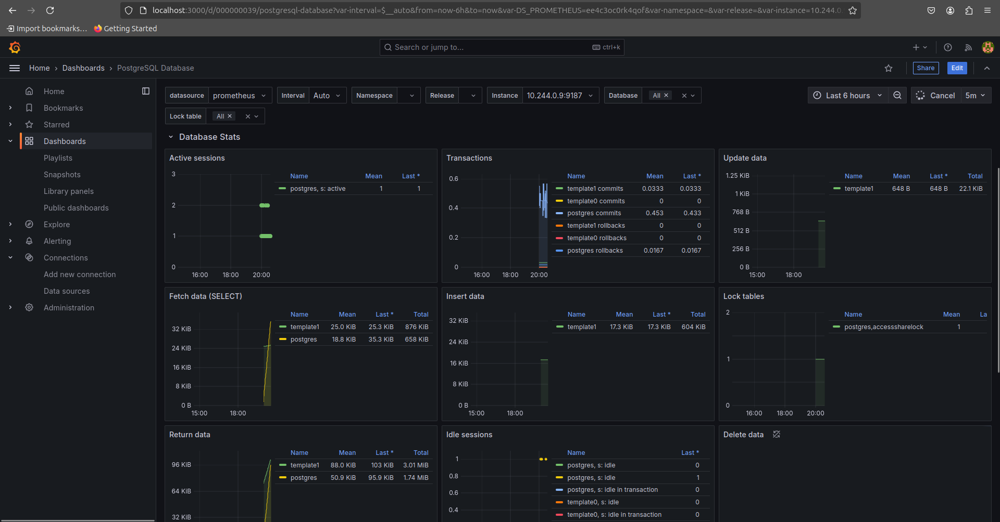